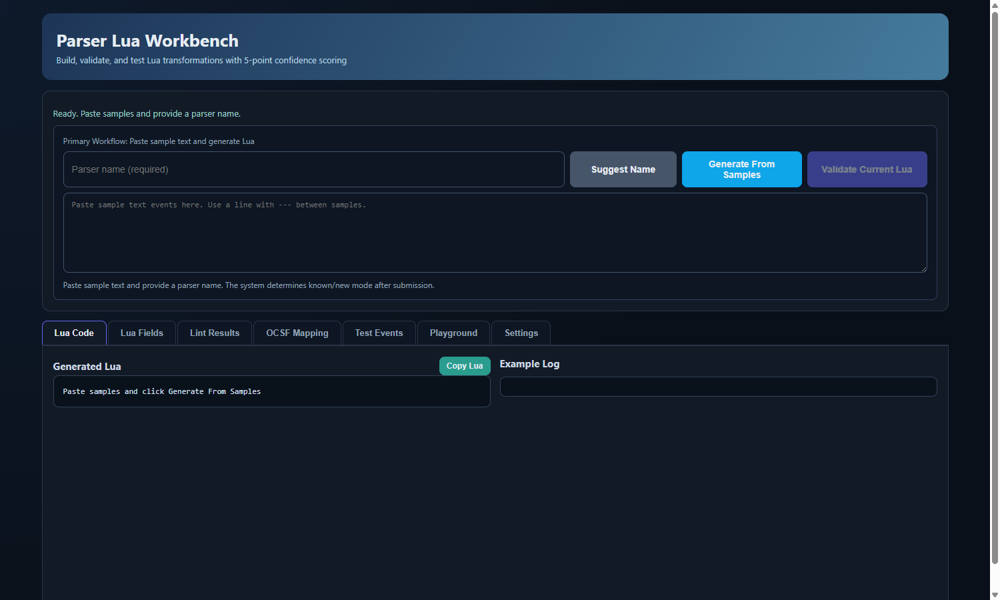
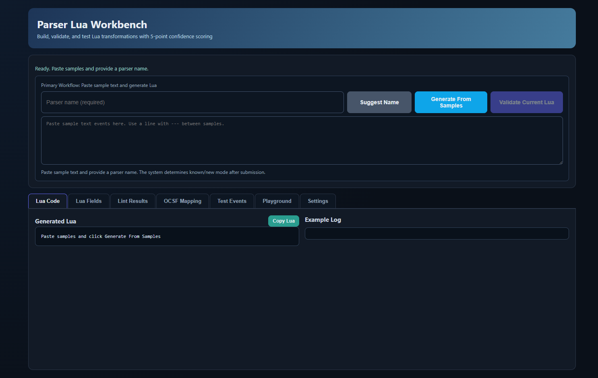
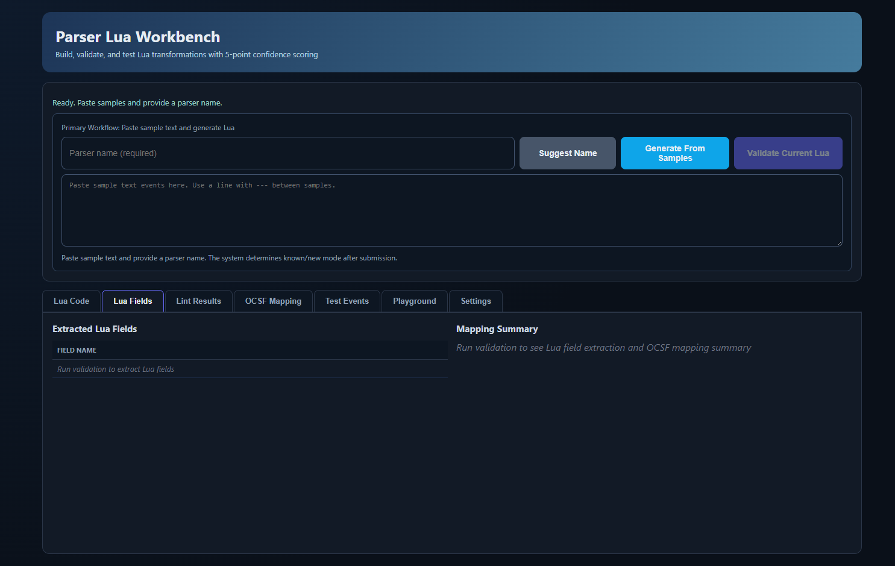
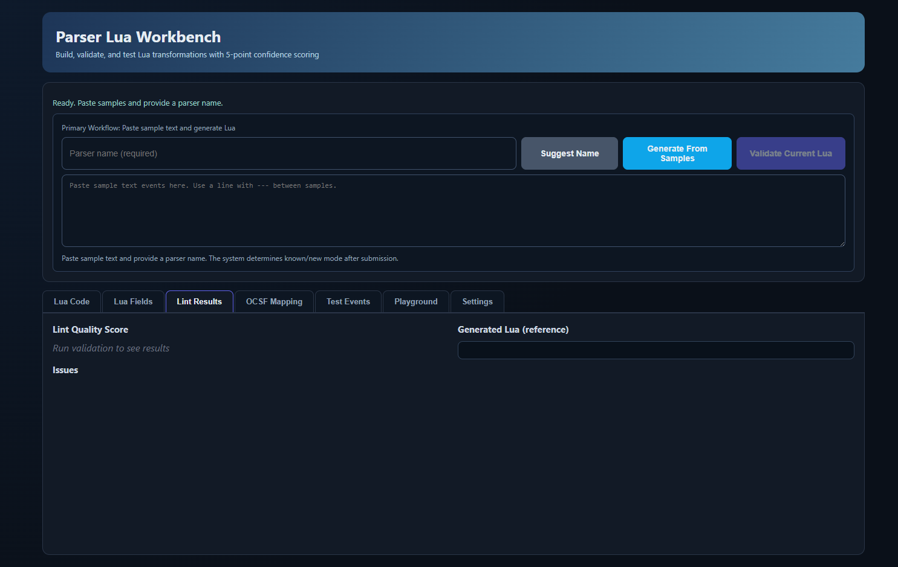
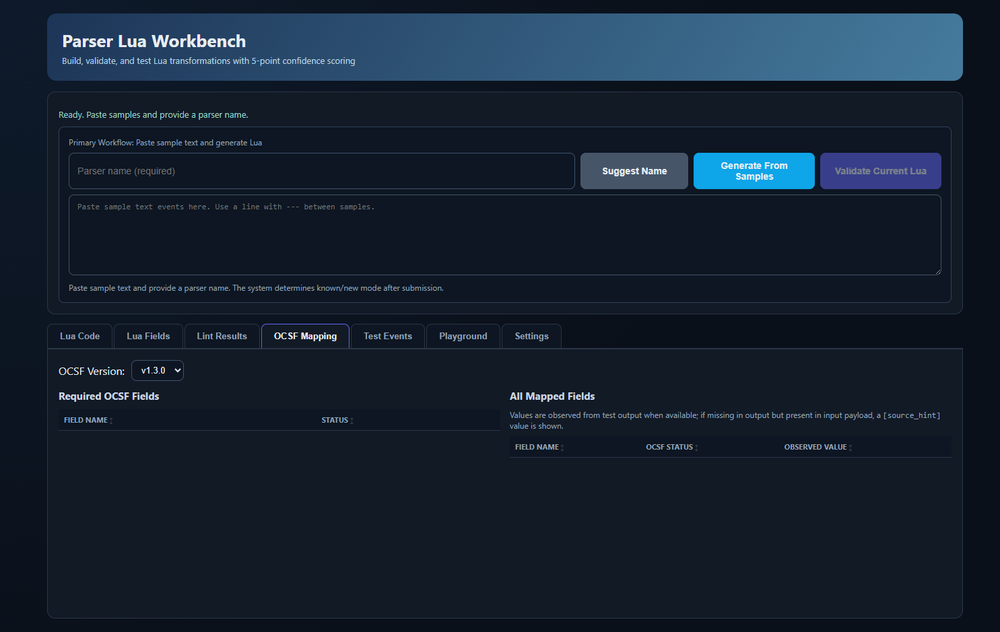
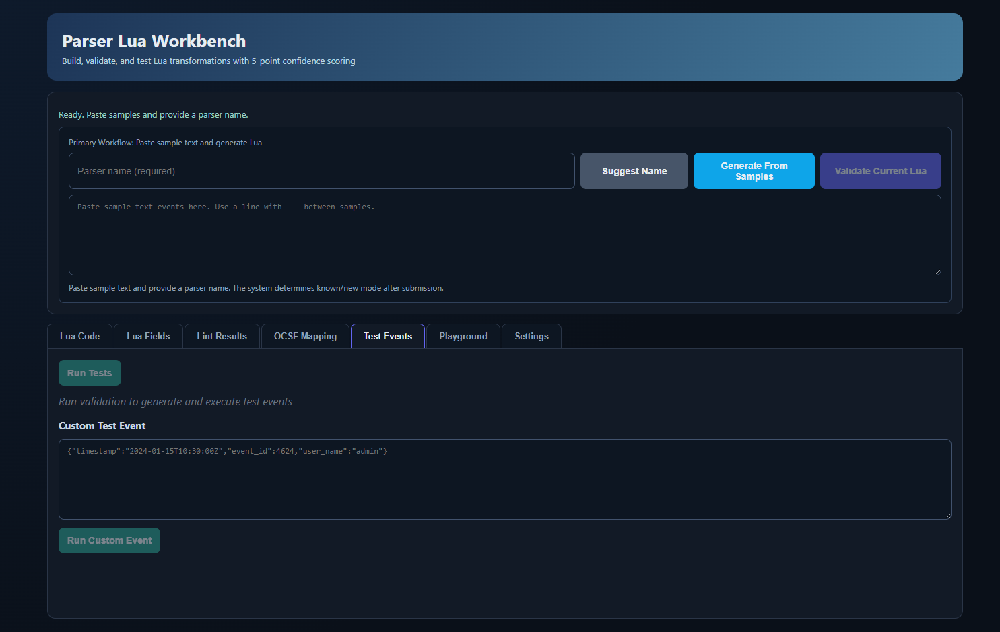
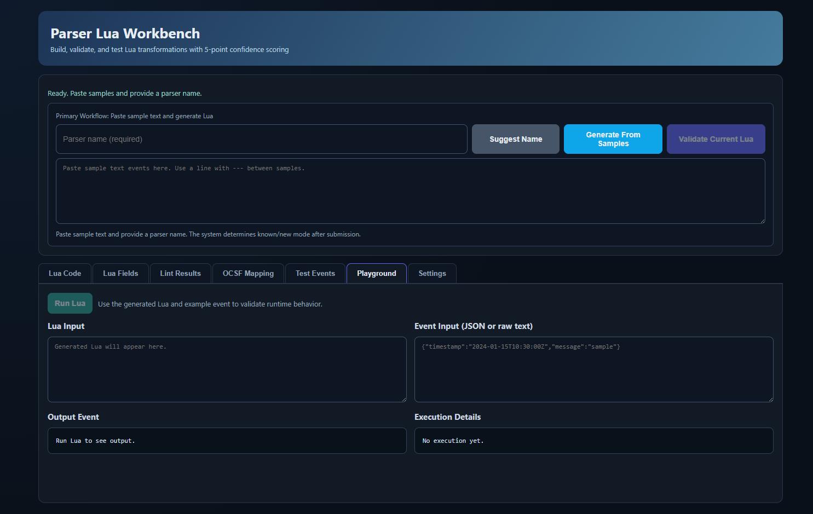
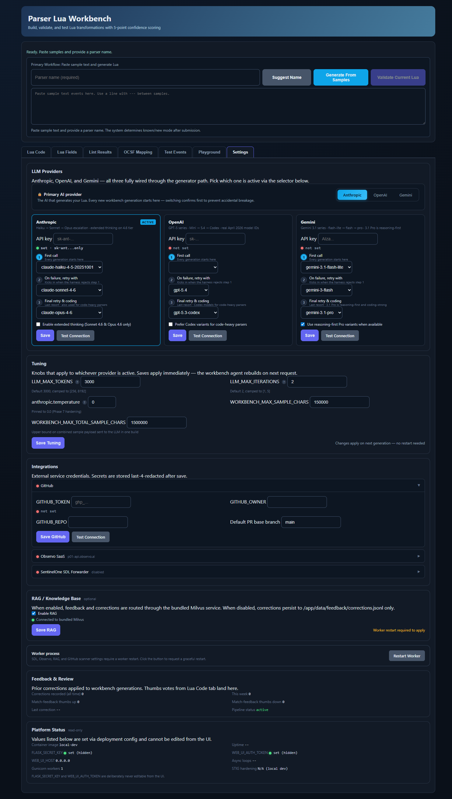

# Purple Pipeline Parser Eater 2

**Automated SentinelOne-to-OCSF Lua conversion with deterministic testing and human-in-the-loop review.**

PPPE2 takes SentinelOne SIEM parser definitions, feeds them through an AI-powered conversion pipeline (Claude, GPT, or Gemini), and produces OCSF-compliant Lua scripts ready to deploy on [Observo.ai](https://observo.ai) -- either the SaaS console or a standalone dataplane binary. Every generated script is scored by a five-check deterministic harness before a human ever sees it, and a Flask workbench lets operators inspect, edit, re-test, and approve results one parser at a time.



---

## Architecture at a Glance

```text
                          +---------------------------+
                          |     Browser / Operator     |
                          +------------+--------------+
                                       |
                               :8080 (HTTP)
                                       |
               +-----------------------v-----------------------+
               |            gunicorn web worker                 |
               |  Flask review UI + workbench + Settings tab    |
               |  wsgi_production.py -> build_production_app()  |
               |                                                |
               |  StateStore (follower)   FeedbackChannel (w)   |
               |  RuntimeProxy (reader)                         |
               +----------+------------------+-----------------+
                          |                  |
                   file IPC (data/ volume)   |
                          |                  |
               +----------v------------------v-----------------+
               |           conversion worker                    |
               | continuous_conversion_service.py --worker-only |
               |                                                |
               |  1. GitHub sync loop   (~60 min)               |
               |  2. Conversion loop    (pop queue -> LLM)      |
               |  3. Feedback drain     (approve/reject/modify) |
               |                                                |
               |  StateStore (writer)   FeedbackChannel (r)     |
               +----------+-----------------------------------+
                          |
                   LLM API calls
                          |
          +---------------v---------------+
          |  Anthropic / OpenAI / Gemini  |
          +-------------------------------+

  Optional (--profile rag):
  +--------+    +------+    +-------+
  | Milvus | <- | etcd | <- | MinIO |
  +--------+    +------+    +-------+
```

**Two sibling processes, one shared `data/` volume.** The web worker serves the UI; the conversion worker runs the AI pipeline. They coordinate through JSON files on the `app-data` Docker volume -- no Redis, no message queue, no database required for core operation.

---

## Feature Highlights

| Feature | Description |
|---------|-------------|
| **Multi-provider LLM** | Anthropic Claude, OpenAI GPT, and Google Gemini -- switch at runtime via the Settings tab |
| **Iterative refinement** | Harness feedback loop with automatic model escalation (Haiku -> Sonnet -> Opus) when scores are low |
| **5-check harness** | Lua validity, linting, OCSF field mapping, source field coverage, and live event execution via `lupa` |
| **7-tab workbench** | Lua Code, Lua Fields, Lint Results, OCSF Mapping, Test Events, Playground, Settings |
| **Dual deploy targets** | SaaS REST API (camelCase JSON) and standalone dataplane binary (snake_case YAML) |
| **GitHub integration** | Auto-scan SentinelOne parser repos, upload approved Lua as PRs |
| **Feedback learning** | Inline corrections persist to JSONL and optionally to Milvus RAG for future prompt enrichment |
| **STIG-hardened Docker** | Read-only root filesystem, non-root user, capability drop, resource limits |

---

## Quick Start

### Prerequisites

- Python 3.11+
- At least one LLM API key (Anthropic, OpenAI, or Gemini)
- Docker and Docker Compose (for containerized deployment)

### Docker (recommended)

```bash
# Clone and configure
git clone https://github.com/your-org/Purple-Pipeline-Parser-Eater-2.git
cd Purple-Pipeline-Parser-Eater-2
cp .env.example .env

# Edit .env -- set at least one LLM key and generate auth secrets:
#   ANTHROPIC_API_KEY=sk-ant-your-key-here
#   FLASK_SECRET_KEY=$(openssl rand -hex 32)
#   WEB_UI_AUTH_TOKEN=$(openssl rand -hex 32)

# Start (core services only)
docker compose --env-file .env up -d

# Start with RAG (adds Milvus + etcd + MinIO)
docker compose --env-file .env --profile rag up -d
```

Open [http://localhost:8080/workbench](http://localhost:8080/workbench) to access the review UI.

### Local Development

```bash
python3 -m venv .venv && source .venv/bin/activate
pip install -r requirements.txt
cp .env.example .env   # set at least one LLM API key

# Service + workbench at http://localhost:8080/
python continuous_conversion_service.py

# Or one-shot CLI batch
python main.py --dry-run --max-parsers 1
```

---

## Workbench Screenshots

| Tab | Screenshot |
|-----|-----------|
| Workbench Overview |  |
| Lua Fields |  |
| Lint Results |  |
| OCSF Mapping |  |
| Test Events |  |
| Playground |  |
| Settings |  |

---

## Documentation

| Document | Audience | Description |
|----------|----------|-------------|
| [Operator's Guide](docs/user-guide.md) | Operators | End-to-end walkthrough of the workbench, generation, testing, and deployment |
| [Architecture](docs/architecture.md) | Developers | Two-process model, IPC, conversion pipeline, harness internals, LLM abstraction |
| [API Reference](docs/api-reference.md) | Developers | Complete REST API with request/response examples |
| [Deployment Guide](docs/deployment.md) | DevOps | Docker Compose, environment variables, production hardening, monitoring |

---

## Environment Variables

Key variables (see [Deployment Guide](docs/deployment.md) for the full table):

| Variable | Required | Default | Purpose |
|----------|----------|---------|---------|
| `ANTHROPIC_API_KEY` | One LLM key required | -- | Anthropic Claude API key |
| `OPENAI_API_KEY` | One LLM key required | -- | OpenAI API key |
| `GEMINI_API_KEY` | One LLM key required | -- | Google Gemini API key |
| `LLM_PROVIDER_PREFERENCE` | No | `anthropic` | Active provider: `anthropic`, `openai`, or `gemini` |
| `FLASK_SECRET_KEY` | Yes (production) | -- | Flask session signing key |
| `WEB_UI_AUTH_TOKEN` | Yes (non-loopback) | -- | Bearer token for API auth |
| `GITHUB_TOKEN` | No | -- | GitHub API token for parser sync and PR upload |

---

## Testing

Tests are organized smallest-to-largest. Run targeted suites first:

```bash
# Smoke tests
pytest tests/test_harness_cli_smoke.py -q

# OCSF alignment
pytest tests/test_harness_ocsf_alignment.py -q

# Workbench API
pytest tests/test_workbench_jobs_api.py tests/test_parser_workbench.py -q

# Broader sweep
pytest tests/test_workbench_*.py tests/test_parser_workbench.py tests/test_harness_*.py -v

# Type checking
mypy components/
```

`lupa` is required for Lua execution tests -- `pip install lupa` if you see unexpected skips.

---

## Project Structure

```text
.
+-- continuous_conversion_service.py   # Conversion worker (3 async loops)
+-- wsgi_production.py                 # Gunicorn WSGI entry point
+-- main.py                           # One-shot CLI batch entry
+-- components/
|   +-- lua_generator.py              # Unified LLM conversion engine
|   +-- agentic_lua_generator.py      # Iterative-mode shim + prompt builders
|   +-- llm_provider.py               # Multi-provider LLM abstraction
|   +-- settings_store.py             # Persistent settings with env fallthrough
|   +-- feedback_system.py            # Correction persistence (JSONL + Milvus)
|   +-- state_store.py                # Writer/follower state for IPC
|   +-- feedback_channel.py           # Append-only action bus (web -> worker)
|   +-- runtime_proxy.py              # Web-side shim for worker status
|   +-- observo_client.py             # SaaS REST API client
|   +-- dataplane_yaml_builder.py     # Standalone YAML builder
|   +-- web_ui/
|   |   +-- app.py                    # Flask app factory
|   |   +-- routes.py                 # All route handlers (~5700 lines)
|   |   +-- parser_workbench.py       # Workbench build/validate/test logic
|   |   +-- security.py               # Auth, CSRF, secret key enforcement
|   +-- testing_harness/
|       +-- harness_orchestrator.py    # 5-check scoring engine
|       +-- dual_execution_engine.py   # Lupa Lua sandbox
|       +-- lua_linter.py             # Syntax + helper usage checks
|       +-- ocsf_schema_registry.py   # OCSF field definitions
|       +-- jarvis_event_bridge.py    # Realistic test events for ~40 parsers
+-- data/                             # Shared IPC volume
+-- output/                           # Accepted Lua + reports
+-- docs/                             # Documentation + screenshots
+-- tests/                            # pytest suites
```

---

## Contributing

1. Fork the repo and create a feature branch
2. Follow the existing code style (no ruff/black/flake8 -- only `mypy` for type checking)
3. Add or update tests for your changes
4. Run `pytest tests/test_harness_cli_smoke.py -q` as a minimum before pushing
5. Run `scripts/run_gitleaks.sh` if you touched any token-shaped strings
6. Run `scripts/run_pip_audit.sh` if you modified `requirements.txt`
7. Keep diffs small and focused -- one concern per PR
8. Submit a pull request with a clear description of the change

---

## License

This project is proprietary. Contact the maintainers for licensing inquiries.
