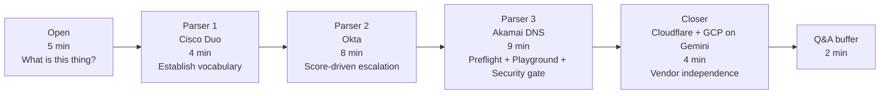
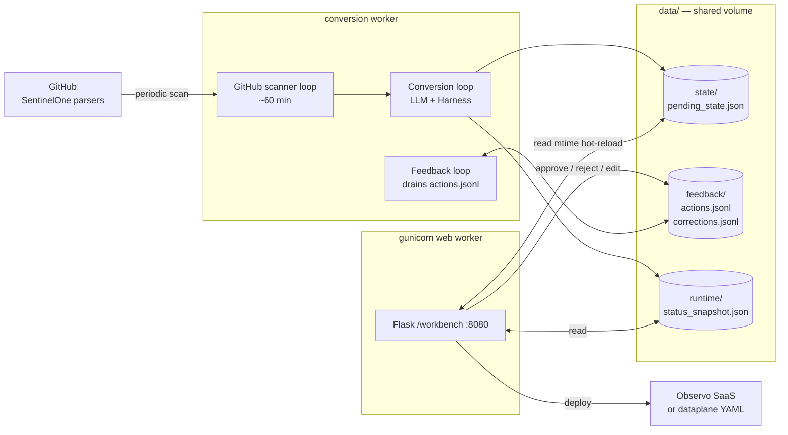
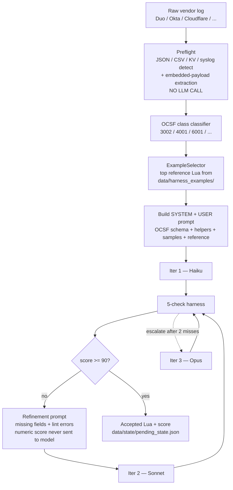
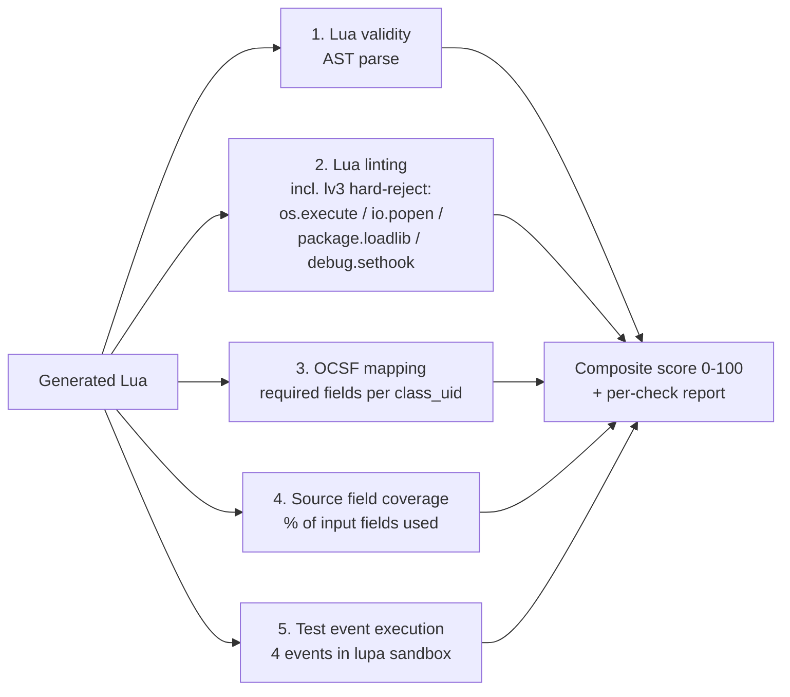

# Lua Workbench Demo — Internal Leadership Review

| | |
|---|---|
| **Date** | 2026-05-05 |
| **Audience** | Internal team / leadership |
| **Format** | Live walkthrough at `http://localhost:8080/workbench` |
| **Runtime** | ~30 minutes (5 open + 4 + 8 + 9 + 4 closer + 2 Q&A buffer) |
| **Hero thesis** | **Quality is auditable, not vibes.** Every Lua transform we ship has a 5-check, 0-100 score behind it. |

---

## Demo arc at a glance



---

## Open (5 min) — "What is this thing?"

Land on `/workbench`. Don't click anything yet. Cover three talking points, then walk through the three diagrams below.

### Talking point 1 — The problem (60s)

> "What you're about to see is the **Purple Pipeline Parser-Eater** — internal codename PPPE-2.
>
> The problem we're solving: SentinelOne ships hundreds of vendor parsers — Cisco Duo, Okta, Cloudflare, GCP, you name it — written in their proprietary tree-walk language. Observo's dataplane runs Lua. To migrate a customer from S1 to Observo, somebody has to translate every parser. By hand, that's a senior detection engineer spending **2-4 hours per parser**. Three hundred parsers is a quarter of someone's year. And every translation is a place to introduce a subtle OCSF mapping bug that won't surface until a detection misses on a real incident."

### Talking point 2 — What it does (90s)

> "What this app does, end to end:
>
> 1. **Scans** the SentinelOne parser repo on a schedule, picks up new or changed parsers.
> 2. **Generates** an Observo-compliant Lua transform using Claude — or OpenAI, or Gemini, all three are wired and switchable from the Settings tab you'll see in a minute.
> 3. **Scores** the result through a 5-check harness — 0 to 100, deterministic, repeatable.
> 4. **Queues** it for human review at this URL.
> 5. If approved, **deploys** to either the Observo SaaS console (REST + JWT) or writes out as standalone YAML for the dataplane binary.
> 6. If rejected or edited, the correction lands in a JSONL file the next generation pass can see.
>
> Two paths in: the daemon batches dozens of parsers a night, and this workbench handles one parser at a time interactively. Same conversion engine behind both."

### Talking point 3 — How it does it (90s)

> "How it does it: **two sibling processes** sharing state through a file-backed volume."

Show the System Architecture diagram below.

> "The split exists for a real reason. The harness can take 60 seconds. You don't want a single hung LLM call freezing the review UI, and you don't want a reviewer's edit blocking the next conversion. Gunicorn worker handles the UI, conversion worker does the heavy lifting, and they meet in the middle on disk.
>
> The conversion engine has two modes. The daemon batches in **fast mode** — one shot, no harness loop, ship to queue. The workbench you're about to see is **iterative mode** — generate, score, refine, escalate Haiku → Sonnet → Opus, capped at three iterations or a score of 90. We pin temperature to zero, so generations are reproducible. Same input, same output, same score."

### System architecture



### Conversion pipeline (one parser, end to end)



### The 5-check harness



> "And one thing worth flagging now, because it pays off in Parser 3: Observo's Lua runtime is **unsandboxed**. PUC-Rio Lua 5.4, full stdlib. `os.execute` would actually run on their dataplane. That makes our `lv3` lint hard-reject a **real security gate**, not a stylistic preference. You'll see it fire."

---

## Parser 1 — Cisco Duo (4 min) — establish vocabulary

**Goal:** every reviewer should leave knowing what each of the 5 checks measures and what a good score looks like.

### Click steps

1. Paste the Duo JSON below into the **samples** textarea (left pane).
2. Click **Generate From Samples**.
3. While Haiku runs (~5-8s), narrate the 5 checks (talk track below).
4. Score lands ~85-92. Walk left-to-right through every check icon at the top — green, green, green.
5. Click **OCSF Mapping** tab → show `class_uid=3002` (Authentication), required fields all green, version selector pinned at v1.3.0.
6. Click **Test Events** tab → 4 events passed.
7. Click **Lua Code** tab → scroll the generated Lua to show the `processEvent` body and the inlined OCSF helpers at the top.

### Talk track

> "Watch the score badge top-left. While it generates, here's what's about to be checked: validity, lint, OCSF field mapping, source field coverage, test event execution. Each one is deterministic Python — no LLM judges this."
>
> [score lands]
>
> "Eighty-seven out of a hundred. Five green checks. I haven't read a line of Lua to know that — the harness did. Let me show you what those checks are actually looking at."
>
> [click OCSF Mapping tab]
>
> "Class UID 3002 — that's OCSF Authentication. Every required field for that class is mapped: actor, src_endpoint, status, time, type_uid. If even one of these were missing, that's a hard fail, not a points deduction."
>
> [click Test Events tab]
>
> "Four real Duo events ran through the generated Lua in a sandboxed Lua VM. All four produced valid OCSF output. **Score isn't a vibe — the code actually executes.**"

### Sample to paste — Cisco Duo Admin API auth event

```json
{
  "timestamp": 1776656452,
  "isotimestamp": "2026-04-20T03:40:52Z",
  "user": {
    "name": "leonard.mccoy",
    "key": "DU3RP9I2WOC59VZX672N",
    "groups": ["Engineering", "On-Call"]
  },
  "access_device": {
    "browser": "Chrome",
    "browser_version": "127.0.6533.99",
    "os": "Mac OS X",
    "os_version": "14.4",
    "ip": "198.51.100.150"
  },
  "auth_device": {
    "name": "iPhone 15 Pro",
    "ip": "198.51.100.150",
    "location": {"city": "Seattle", "state": "WA", "country": "US"}
  },
  "application": {
    "name": "Okta SSO",
    "key": "DI5CT4JTV0EGQR3M9XPK"
  },
  "factor": "Duo Push",
  "result": "success",
  "reason": "User approved",
  "event_type": "authentication",
  "txid": "9c4d1e3f-2a1b-4c7d-9b0e-1f2e3d4c5b6a"
}
```

### Punchline

> "Five checks. Eighty-seven out of a hundred. **I didn't read a single line of Lua to know that.**"

---

## Parser 2 — Okta (8 min) — score-driven escalation

**Goal:** show that escalation is a *reaction to the score*, not a guess. Spend the most screen time on **OCSF Mapping** and **Lua Fields** tabs because they visualize what the model got vs. what it missed.

### Click steps

1. Paste the Okta JSON below → Generate.
2. Lands ~62 on Haiku. **Don't apologize — this is the point.**
3. Click **Lua Fields** tab → show count of extracted fields.
4. Click **OCSF Mapping** tab → red rows for missing nested mappings (`actor.id` → `actor.user.uid`, `target[].alternateId`, etc.).
5. Refinement loop runs. Model name flips Haiku → Sonnet visibly. Talk track during the wait.
6. Score climbs to ~88. Re-open OCSF Mapping → previously red rows now green.
7. Open **Test Events** tab → click **Custom Test Event** → paste the alternate Okta event below (different `eventType`). Run. Pass.

### Talk track

> "Same paste-and-generate. Watch the score."
>
> [score lands at 62]
>
> "Sixty-two. That's a fail. And we want to see this — that's the harness telling us Haiku missed something."
>
> [click OCSF Mapping]
>
> "The red rows are required OCSF fields the generated Lua didn't populate. `actor.user.uid` — Okta nests that as `actor.id`. `target[].alternateId` — same problem, nested arrays are where one-shot models slip up. **The harness sees this without us looking.**"
>
> [refinement loop running]
>
> "Now what's happening: the harness fed the missing fields and lint errors back into a refinement prompt. Note what it did *not* feed back: the numeric score. The model never sees its own grade — only the deltas. That keeps it from gaming the score."
>
> "And watch the model name — Haiku just flipped to Sonnet. **That's score-driven escalation, not me guessing.** The escalation rule is: two iterations under 90, escalate to the next tier."
>
> [score lands at 88]
>
> "Eighty-eight. Same OCSF Mapping tab — now green. Sonnet had context Haiku didn't, because we gave it the harness output as a refinement signal."
>
> [Custom Test Event pass]
>
> "And to prove this isn't memorization — here's an Okta event the model never saw, with a different `eventType`. Same Lua. Same OCSF output. Generalizes."

### Sample to paste — Okta System Log event

```json
{
  "uuid": "8a7b6c5d-1234-4567-8901-abcdef123456",
  "published": "2026-04-20T14:22:18.392Z",
  "eventType": "user.session.start",
  "version": "0",
  "displayMessage": "User login to Okta",
  "severity": "INFO",
  "client": {
    "userAgent": {
      "rawUserAgent": "Mozilla/5.0 (Macintosh; Intel Mac OS X 10_15_7) AppleWebKit/537.36",
      "os": "Mac OS X",
      "browser": "CHROME"
    },
    "geographicalContext": {
      "city": "Boston",
      "state": "Massachusetts",
      "country": "United States",
      "postalCode": "02108",
      "geolocation": {"lat": 42.3554, "lon": -71.0605}
    },
    "zone": "null",
    "ipAddress": "203.0.113.47",
    "device": "Computer"
  },
  "actor": {
    "id": "00u9k7q3xpL1aB2cD3e4",
    "type": "User",
    "alternateId": "nyota.uhura@enterprise.example",
    "displayName": "Nyota Uhura"
  },
  "outcome": {"result": "SUCCESS", "reason": "Multifactor"},
  "transaction": {"id": "YxWvUtSrQpOnMlKjIhGfEd", "type": "WEB"},
  "debugContext": {
    "debugData": {"requestId": "req-AbCdEfGhIjKlMnO", "authenticationContext": "PASSWORD"}
  },
  "authenticationContext": {
    "authenticationProvider": "FACTOR_PROVIDER",
    "credentialProvider": "OKTA_CREDENTIAL_PROVIDER",
    "credentialType": "PASSWORD",
    "issuer": null,
    "externalSessionId": "trsxYzAbCdEfGhIjKlMn"
  },
  "target": [
    {
      "id": "00ub0oNGTSWTBKOLGLNR",
      "type": "AppInstance",
      "alternateId": "GitHub",
      "displayName": "GitHub Enterprise"
    }
  ]
}
```

### Custom Test Event — Okta account lock (paste into **Custom Test Event** in the Test Events tab)

```json
{
  "uuid": "7f6e5d4c-aaaa-bbbb-cccc-1111deadbeef",
  "published": "2026-04-20T14:31:02.118Z",
  "eventType": "user.account.lock",
  "version": "0",
  "displayMessage": "Max sign in attempts exceeded",
  "severity": "WARN",
  "client": {
    "userAgent": {"rawUserAgent": "curl/8.4.0", "os": "Unknown", "browser": "Unknown"},
    "geographicalContext": {"city": "Unknown", "country": "Unknown"},
    "ipAddress": "192.0.2.211"
  },
  "actor": {
    "id": "00u9k7q3xpL1aB2cD3e4",
    "type": "User",
    "alternateId": "nyota.uhura@enterprise.example",
    "displayName": "Nyota Uhura"
  },
  "outcome": {"result": "FAILURE", "reason": "INVALID_CREDENTIALS"}
}
```

### Punchline

> "Sixty-two to eighty-eight. Same paste, same generator. **The harness drove the work.**"

---

## Parser 3 — Akamai DNS (9 min) — preflight + Playground + security gate

**Goal:** show three things — deterministic preflight is free; the Playground proves the Lua actually executes; and the security gate is real, not theater. Hardest parser carries the heaviest message.

### Sub-beat 3a — Preflight is free (2 min)

Paste the wrapper JSON below. **Don't click Generate yet.** Point at the preflight banner that flags "embedded JSON payload detected."

> "Look at this raw event. The real DNS event is *inside* a string-wrapped `message` field. That's how Akamai delivers SIEM data. If we just hand this to the LLM, half the time it'll mistake the wrapper for the event and we get garbage Lua.
>
> But before any LLM call — pure Python regex and JSON probe — preflight detected the embedded payload, extracted it, and is going to present *both* the wrapper and the unwrapped inner event to the model. **No tokens spent on that. Zero. Deterministic.**
>
> This is the cheapest, most reliable layer of the system. We do everything we can without an LLM, and only call out when we have to."

### Sub-beat 3b — Playground proves runtime (3 min)

Click **Generate**. Score ~75-82.

1. Click the **Playground** tab.
2. Generated Lua is on the left, the example event on the right.
3. Click **Run Lua**.
4. Output event shows OCSF Network Activity (`class_uid` 4001) with the inner DNS fields (`queryName`, `clientIp`, `threatScore`, `category`) properly mapped through.

> "This is the **Playground** tab. It's a sandboxed Lua VM running the same `lupa` engine the harness uses. Generated Lua on the left, the input event on the right. I click Run."
>
> [click Run]
>
> "There's the OCSF output. Class UID 4001 — Network Activity, the right OCSF class for DNS. The inner `queryName` mapped to `query_name`. `clientIp` mapped to `src_endpoint.ip`. `threatScore` mapped through to a confidence score. **Score isn't a vibe — the code actually runs.**"

### Sub-beat 3c — Security gate live (3 min)

Switch back to the **Lua Code** tab. The generated Lua is editable.

1. Click into the Lua, find the `processEvent` body, and inject a literal `os.execute("ls /")` line.
2. Click **Validate** (or **Run Tests**).
3. Watch lint check go red, hard-reject fires, score craters to near-zero.

> "Now I'm going to do something I shouldn't. Watch the score."
>
> [type `os.execute("ls /")` into the Lua]
>
> "Observo's Lua runtime is **unsandboxed**. Full PUC-Rio Lua 5.4 stdlib. `os.execute` would actually shell out on their dataplane node. That's not a hypothetical."
>
> [click Validate]
>
> "Lint check goes red. Hard-reject fires. Score craters. **And** — here's the part that matters — this same `lint_script(context=\"lv3\")` call also gates the deploy endpoint at `/api/v1/workbench/upload-pr`. Even if a model gets jailbroken, even if a reviewer accidentally pastes something dangerous, the deploy path won't accept it."
>
> "This is what 'auditable' actually means. The score is a contract, but the lint is a hard wall."

### Sub-beat 3d — Save correction (1 min)

1. Revert the `os.execute` injection.
2. Click **Save correction** with reason: `"demo: undo os.execute injection"`.
3. From a side terminal: `tail -1 data/feedback/corrections.jsonl` — show the appended row.

> "And one last thing — when a reviewer fixes generated Lua, that correction lands in a JSONL file the next generation pass can see. It's not real-time RAG yet — corrections only influence the *next* parser once the example pool re-scans — but the data is durable. Reviewer time becomes signal, not just labor."

### Sample to paste — Akamai DNS with embedded payload

```json
{
  "type": "akamai_siem",
  "format": "json",
  "version": "1.0",
  "streamId": 12345,
  "tenantId": "akamai-prod",
  "received_at": "2026-04-20T18:07:33Z",
  "message": "{\"queryName\":\"login.malicious-domain.example\",\"queryType\":\"A\",\"resolverIp\":\"10.20.30.40\",\"clientIp\":\"192.0.2.88\",\"responseCode\":\"NXDOMAIN\",\"timestamp\":1776715653,\"action\":\"blocked\",\"category\":\"phishing\",\"threatScore\":92,\"policyName\":\"corp-dns-protect\",\"deviceId\":\"laptop-eng-117\"}"
}
```

### Custom Playground event — Akamai DNS malware C2 (paste into the Playground event input)

```json
{
  "type": "akamai_siem",
  "format": "json",
  "version": "1.0",
  "streamId": 12345,
  "received_at": "2026-04-20T18:09:47Z",
  "message": "{\"queryName\":\"c2.example-malware.io\",\"queryType\":\"A\",\"clientIp\":\"192.0.2.144\",\"responseCode\":\"NOERROR\",\"timestamp\":1776715787,\"action\":\"alerted\",\"category\":\"malware-c2\",\"threatScore\":99,\"policyName\":\"corp-dns-protect\",\"deviceId\":\"laptop-finance-22\"}"
}
```

### Punchline

> "Preflight saved tokens. Playground proved it runs. Lint blocked dangerous code. **All three are deterministic. None of them are the LLM.**"

---

## Closer — Cloudflare WAF + GCP Audit on Gemini (4 min) — vendor independence

**Goal:** prove the score is the contract and the LLM provider is just a knob. Two new vendors the audience hasn't seen yet, both on a different LLM family.

### Click steps

1. Click **Settings** tab → flip primary provider Anthropic → **Gemini**.
2. Back to the workbench paste area. Paste **Cloudflare WAF** sample below → Generate.
3. Score lands in 80s. Skim the OCSF Mapping tab — class_uid 4001 (Network Activity) or 6003 (Web Resources Activity) depending on classification.
4. Paste **GCP Cloud Audit Log** sample → Generate.
5. Score lands in 80s. Note class_uid 3005 (Account Change) or 6005 (API Activity).
6. Don't deep-dive either — let the *fact* that they passed do the talking.

### Talk track

> "I'm flipping the primary provider to Gemini. Different LLM family, different vendor, different training data."
>
> [paste Cloudflare]
>
> "Cloudflare WAF event. SQL injection block. Different shape, different vocabulary — `RayID`, `EdgeColoCode`, `WAFAction`. Generate."
>
> [score lands]
>
> "Eighty-three. Mapped to OCSF web activity. Same harness, same five checks — and Gemini just produced a transform that scored within five points of what Anthropic gave us on Cisco Duo."
>
> [paste GCP]
>
> "GCP Cloud Audit Log. Even further afield — proto-payload nesting, `authenticationInfo`, `authorizationInfo`. Generate."
>
> [score lands]
>
> "Eighty-one. Account change class. Same five checks, green across the board.
>
> **Score is the contract. Provider is a knob. We are not locked in.** If Anthropic doubles their pricing tomorrow, we move. If Gemini ships a model that beats Sonnet on cost-per-quality, we route there. The harness doesn't care which LLM produced the Lua — it grades the Lua."

### Sample to paste — Cloudflare WAF event

```json
{
  "RayID": "8e2f7c9d4a8b1234",
  "EdgeStartTimestamp": "2026-04-20T15:30:42.391Z",
  "EdgeEndTimestamp": "2026-04-20T15:30:42.428Z",
  "EdgeResponseStatus": 403,
  "ClientIP": "203.0.113.99",
  "ClientCountry": "ru",
  "ClientASN": 12345,
  "ClientASNDescription": "EXAMPLE-ASN",
  "ClientRequestHost": "api.example.com",
  "ClientRequestMethod": "POST",
  "ClientRequestURI": "/v1/login",
  "ClientRequestUserAgent": "Mozilla/5.0 (compatible; sqlmap/1.7.2)",
  "ClientRequestProtocol": "HTTP/2",
  "WAFAction": "block",
  "WAFRuleID": "100015",
  "WAFRuleMessage": "SQL injection attempt detected",
  "WAFFlags": "0",
  "WAFMatchedVar": "ARGS:username",
  "WAFProfile": "high",
  "EdgeColoCode": "FRA",
  "EdgeColoID": 24,
  "ZoneID": "abc123def456",
  "ZoneName": "example.com",
  "SecurityLevel": "high",
  "OriginIP": "10.0.1.50",
  "OriginResponseStatus": 0,
  "BotScore": 1,
  "BotScoreSrc": "Verified Bot"
}
```

### Sample to paste — GCP Cloud Audit Log (IAM SetIAMPolicy)

```json
{
  "protoPayload": {
    "@type": "type.googleapis.com/google.cloud.audit.AuditLog",
    "authenticationInfo": {
      "principalEmail": "spock@enterprise.example.com",
      "principalSubject": "user:spock@enterprise.example.com"
    },
    "requestMetadata": {
      "callerIp": "198.51.100.42",
      "callerSuppliedUserAgent": "google-cloud-sdk gcloud/465.0.0 command/gcloud.iam.policies.set,gzip(gfe)",
      "requestAttributes": {"time": "2026-04-20T17:14:22.118Z"},
      "destinationAttributes": {}
    },
    "serviceName": "iam.googleapis.com",
    "methodName": "google.iam.admin.v1.SetIAMPolicy",
    "authorizationInfo": [
      {
        "resource": "projects/enterprise-prod",
        "permission": "resourcemanager.projects.setIamPolicy",
        "granted": true
      }
    ],
    "resourceName": "projects/enterprise-prod",
    "request": {
      "@type": "type.googleapis.com/google.iam.v1.SetIamPolicyRequest",
      "resource": "projects/enterprise-prod"
    },
    "response": {
      "@type": "type.googleapis.com/google.iam.v1.Policy",
      "bindings": [
        {
          "role": "roles/owner",
          "members": [
            "user:spock@enterprise.example.com",
            "user:newuser@enterprise.example.com"
          ]
        }
      ]
    }
  },
  "insertId": "1abc2def3ghi4jkl",
  "resource": {
    "type": "project",
    "labels": {"project_id": "enterprise-prod"}
  },
  "timestamp": "2026-04-20T17:14:22.118Z",
  "severity": "NOTICE",
  "logName": "projects/enterprise-prod/logs/cloudaudit.googleapis.com%2Factivity",
  "operation": {"id": "operations/abc123", "producer": "iam.googleapis.com"},
  "receiveTimestamp": "2026-04-20T17:14:22.451Z"
}
```

### Closing punchline

> "Five vendors today — Cisco, Okta, Akamai, Cloudflare, GCP. Two LLM families. One harness. **Score is the contract.**"

---

## Q&A buffer (2 min) — anticipated questions

| Question | Answer |
|---|---|
| *"How do you know the score itself is right?"* | Each check is deterministic Python. OCSF schema is statically embedded. Lint is rule-based, not LLM-judged. The `lupa` execution either succeeds against a known event or it doesn't. No subjective judgment anywhere in the score. |
| *"Can the model game the score?"* | No. The numeric score never goes into the refinement prompt. Only missing-field names and lint-error strings do. The model is told what's wrong, never told its grade. |
| *"What's the cost?"* | Haiku-first means most parsers never escalate. Workbench bypasses the daemon's accept-cache so we never serve stale results, but production daemon hits cache on re-runs. Corrections file is local JSONL — Milvus integration is optional. |
| *"What happens when the harness is wrong about a parser?"* | Reviewer overrides via the inline edit + Save Correction flow. Corrections are durable and feed the next generation pass. Plus the harness reports per-check, so the reviewer sees exactly *which* check is hurting the score. |
| *"Does this scale beyond OCSF?"* | OCSF is the schema layer today, but the 5-check pattern (validity, lint, schema-conformance, coverage, execution) is generic. Swap the schema registry, keep the rest. |
| *"Why three iterations max?"* | Empirical. Iteration 4+ rarely improves and burns tokens. If we're at 75 after iteration 3, the parser usually needs a human eye, not more LLM cycles. |
| *"Why temperature=0?"* | Reproducibility. Same parser, same input, same output, same score. Auditability requires determinism. |
| *"What about the Observo runtime sandbox?"* | There isn't one. PUC-Rio Lua 5.4, full stdlib, `os.execute` available. Our `lv3` lint hard-reject is the security boundary, not their VM. (See the Akamai live-injection beat.) |

---

## Safety nets — when the live demo bites

| Risk | Symptom | Recovery |
|---|---|---|
| LLM rate limit / network blip | Generation hangs > 30s with no token stream | Cancel, click Generate again. Talk track: *"And this is why we have a job queue, not a single blocking call."* |
| Score lands lower than expected on Parser 1 | Cisco Duo scores < 80 | Don't apologize. Pivot the talk track to *"and here's what the harness flagged"* — let the audit story carry. |
| Sonnet escalation doesn't trigger on Parser 2 | Score happens to land >= 90 on Haiku | Skip the escalation talk track, lean harder on the OCSF Mapping tab visual. The "score is the contract" point still lands. |
| Akamai preflight banner doesn't render | Embedded payload not detected in the UI | Skip sub-beat 3a, jump to 3b. Mention preflight in passing during 3c. |
| Lint hard-reject doesn't fire on `os.execute` | Score doesn't crater | **Critical to recover.** Switch to terminal: `python -c "from components.testing_harness.lua_linter import lint_script; print(lint_script('local x = os.execute(\"ls\")', context=\"lv3\"))"` — show the lint output directly. |
| Gemini provider swap fails | Settings save errors / generation fails on Gemini | Skip the Gemini parsers, run Cloudflare + GCP on Anthropic. Adjust talk track: *"different vendors, same provider — and we'd run this on Gemini in production for cost."* |
| Save Correction errors | Network failure on POST | Show `data/feedback/corrections.jsonl` directly via `cat` to demonstrate the file exists and has prior entries. |

---

## Pre-flight (skip if env is already up)

- [x] `docker compose --env-file .env up -d` — confirm `http://localhost:8080/workbench` loads.
- [ ] Settings tab → Anthropic active, primary = Haiku, strong = Sonnet, escalation enabled, temperature pinned 0.
- [ ] `.env` has `ANTHROPIC_API_KEY` and `GEMINI_API_KEY`.
- [ ] Browser zoomed to ~125% so the score badge and tab strip read on screen-share.
- [ ] **Pre-warm**: paste the Cisco Duo sample once before the audience joins so first-call latency doesn't hit Parser 1.
- [ ] Side terminal open with: `tail -f data/feedback/corrections.jsonl` (for the Akamai sub-beat 3d reveal).
- [ ] `data/state/web_ui_auth.token` printed and stashed in case curl fallback is needed.

---

## Screenshot capture points

Take these during a dry-run pass and paste them into this doc inline (under each parser section). They double as a fallback narrative if anything goes sideways live.

| # | Where | What to capture | Why |
|---|---|---|---|
| 1 | `/workbench` landing | Empty state with the 5-check icon row + 7 tabs visible | Anchor for the Open's "this is the surface area" |
| 2 | After Cisco Duo generates | Score badge showing 87, all 5 checks green | Headline image for Parser 1 |
| 3 | Okta — OCSF Mapping tab, mid-iteration | Red rows for missing nested fields (before escalation) | Contrast with #4 |
| 4 | Okta — OCSF Mapping tab, post-Sonnet | Same fields now green | "The harness drove the work" image |
| 5 | Akamai — preflight banner | "Embedded JSON payload detected" indicator | Cheap-deterministic-layer image |
| 6 | Akamai — Lint Results tab with `os.execute` injected | Hard-reject fired, score 0 | The security-gate punchline image |
| 7 | Settings tab | Provider segmented control showing Gemini active | Vendor-independence image |
| 8 | `tail -1 data/feedback/corrections.jsonl` | The reviewer correction landed on disk | "Reviewer time becomes signal" image |

---

## File-and-line references during the talk

If anyone asks "where does X live in the code":

- 5-check harness orchestration → [components/testing_harness/harness_orchestrator.py](../../components/testing_harness/harness_orchestrator.py) `run_all_checks()`
- Iterative refinement + escalation ladder → [components/lua_generator.py](../../components/lua_generator.py) `_run_iterative_loop_sync`
- `lv3` lint hard-reject set → [components/testing_harness/lua_linter.py](../../components/testing_harness/lua_linter.py) `lint_script(context="lv3")`
- Workbench routes → [components/web_ui/routes.py](../../components/web_ui/routes.py) (search for `/api/v1/workbench/`)
- ParserLuaWorkbench engine → [components/web_ui/parser_workbench.py](../../components/web_ui/parser_workbench.py)
- LLM provider abstraction → [components/llm_provider.py](../../components/llm_provider.py)
- OCSF helpers (inlined into prompt) → [components/testing_harness/lua_helpers/ocsf_helpers.lua](../../components/testing_harness/lua_helpers/ocsf_helpers.lua)
- Corrections sink → `data/feedback/corrections.jsonl` (live file, gitignored)
- Pending state shared between worker + UI → `data/state/pending_state.json` (live file, gitignored)
